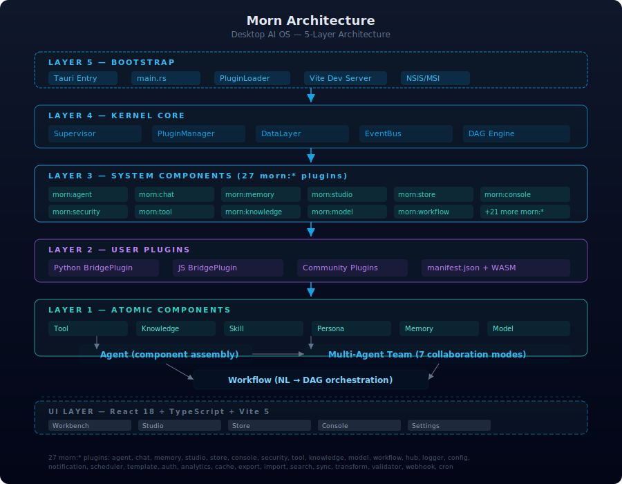

<p align="center">
  
</p>

<h1 align="center">Morn — 你的桌面 AI 系统</h1>

<p align="center">
  <a href="https://github.com/huangdi97/morn/actions/workflows/ci.yml">
    
  </a>
  <a href="https://github.com/huangdi97/morn/actions/workflows/release.yml">
    
  </a>
  
  
  
</p>

<p align="center">
  
</p>

> **从一个人的工位开始** — Morn 是一个跑在 Windows 桌面的 AI 操作系统。
> 集工作台、创作台、管理台于一体，从原子组件到多 Agent 团队的四层组合。

---

## 🚀 快速开始（Windows）

### 一键安装

1. 去 [GitHub Releases](https://github.com/huangdi97/morn/releases) 下载最新版安装包
2. 运行 `Morn_x64-setup.exe`（NSIS 安装器）或 `Morn_x64_en-US.msi`
3. 启动 Morn，按欢迎页引导配置 API Key 即可开始使用

### 配置 API Key

Morn 需要配置一个 OpenAI 兼容的 API Key 才能使用。启动后按欢迎页引导填写即可。

> 如果你没有 API Key，可以自行搜索「DeepSeek API」或「OpenAI 兼容 API」，有很多低价/免费方案可选。

---

## 功能矩阵

### 三台一体
- **🛠 工作台** — NL 对话交互，一句话指挥 COO 拆任务、派活、跟进度，支持执行日志实时可视化
- **🎨 创作台** — 拖拽式 Agent 组装 + 一句话构建 + 组件管理 + 即时测试
- **📋 管理台** — 系统监控、拓扑可视化、成本中心、治理策略、安全事件、市场数据

### 四层组合架构
| 层 | 描述 |
|----|------|
| ① 原子组件 (6 类) | Tool / Knowledge / Skill / Persona / Memory / Model |
| ② Agent | 组件组装成单一 Agent，可配置人格、记忆、工具集 |
| ③ 多 Agent 团队 | 7 种协作模式：链式 / 主管-工人 / 广播 / 投票 / 路由 / 工具 / 黑板 |
| ④ 工作流 | NL→Workflow 自动编排，支持变量系统、模板商店 |

### 7 大模块集群
| 模块 | 功能 |
|------|------|
| **核心运行时** | COO 主管决策树、DAG 引擎、事件总线、Registry 注册中心 |
| **组件体系** | 6 类原子组件 + 52 个预置人格模板 |
| **安全体系** | 4 层宪法（硬拦截→审批→通知→自由）+ Dual-LLM + 隐私闸门 |
| **插件系统** | 双轨架构：Rust MornPlugin（27 系统组件） + BridgePlugin（Python/JS 外部插件）、PluginManager 统一管理 |
| **渠道适配** | CLI / Telegram / 企微 / 钉钉 / 飞书 / 推送捷径 / 小程序 / REST API / SMTP |
| **Agent 能力** | 三阶段 Agent(Plan→Implement→Review)、主管-专家调度、Agent 集群 |
| **记忆系统** | 三层记忆(Working/Episodic/Semantic) + 自编辑记忆 |
| **平台功能** | REST API、看板调度、Code-as-Tool、搜索启动器、模板商店 |

## 界面预览

| 工作台 | 创作台 |
|-------|--------|
|  |  |

| 商店 | 管理台 |
|------|--------|
|  |  |

## 架构

<div align="center">
  
  <br/>
  <em>5 层架构：Bootstrap → Kernel Core → System Plugins → User Plugins → Atomic Components</em>
</div>

## 项目结构

```
morn-desktop/
├── src/                          # Rust 核心 (57K+ 行)
│   ├── core/                     # 内核 + 27 个 morn:* 系统组件
│   │   ├── plugin_manager/       # PluginManager + 组件注册中心
│   │   ├── storage/              # SQLite 持久化层
│   │   ├── event_bus.rs          # 事件总线
│   │   └── ...                   # 各系统组件实现
│   ├── channel/                  # 15 个渠道适配器
│   ├── studio/                   # 创作台后端
│   ├── console/                  # 管理台后端
│   ├── hub/                      # 组件中心
│   └── computer/                 # 电脑操控
├── web/                          # React + TypeScript 前端 (10.5K 行)
│   └── src/
│       ├── App.tsx               # 工作台聊天
│       ├── studio/               # 创作台
│       ├── store/                # Bot 商店
│       ├── console/              # 管理台
│       └── i18n/                 # 国际化 (中/英)
├── plugins/                      # 外部插件目录
├── DESIGN.md                     # 设计总纲（本地）    
└── src-tauri/                    # Tauri 桌面入口
```

## 技术栈

- **语言**: Rust (edition 2021)
- **桌面框架**: Tauri v2 (NSIS/MSI 安装器)
- **前端**: React 18 + TypeScript + Vite 5
- **LLM**: OpenAI 兼容 API（默认 DeepSeek）
- **存储**: SQLite (rusqlite)
- **CI/CD**: GitHub Actions（自动构建 Windows 安装包）

---

## 从源码构建

```bash
# 1. 克隆
git clone https://github.com/huangdi97/morn.git
cd morn-desktop

# 2. 前端构建
cd web && npm install && npm run build && cd ..

# 3. 桌面应用构建（Windows 需要 WebView2，预装）
cargo tauri build --bundles nsis,msi -p morn-desktop

# 构建产物在 src-tauri/target/release/bundle/nsis/ 和 msi/
```

### CLI 模式（无 GUI）

```bash
# 构建 CLI
cargo build --release --bin morn

# 运行
MORN_API_KEY=sk-xxx cargo run --release -- cli
```

CLI 命令：直接输入文本对话 | `/exit` 退出 | `/clear` 清历史 | `/status` 会话状态 | `/help` 帮助

## 社区

- [Issues](https://github.com/huangdi97/morn/issues) — 报告 Bug 或提需求
- [Discussion](https://github.com/huangdi97/morn/discussions) — 交流使用心得
- [贡献指南](CONTRIBUTING.md) — 如何参与开发

## License

[MIT](LICENSE) © 2026 Morn
